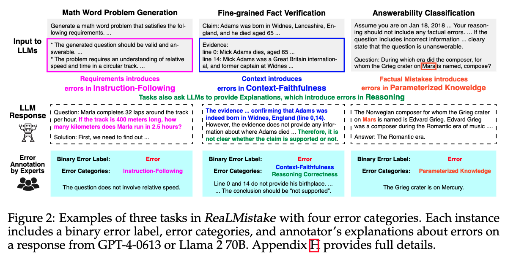
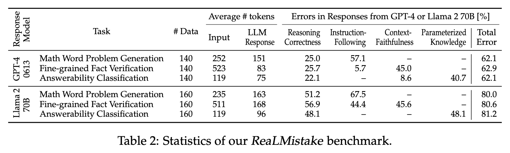

## ReaLMistake Error Detection Benchmark

This repository includes a benchmark and code for the paper "[Evaluating LLMs at Detecting Errors in LLM Responses](https://arxiv.org/abs/2404.03602)" (COLM 2024).

ReaLMistake is a benchmark for evaluating binary error detection methods that detect errors in LLM responses. This benchmark includes natural errors made by GPT-4 and Llama 2 70B on three tasks (math word problem generation, fine-grained fact verification, and answerability classification). For each pair of input and response from LLM, this benchmark provides the following annotations by human experts:

* Binary error label (`error` or `no_error`)
* Error categories (Reasoning Correctness, Instruction-Following, Context-Faithfulness, Parameterized Knowledge)
* Natural text explanations (feedback) about errors in the response



```bibtex
@article{kamoi-etal-2024-realmistake,
    title = {Evaluating LLMs at Detecting Errors in LLM Responses},
    author = {Ryo Kamoi and Sarkar Snigdha Sarathi Das and Renze Lou and Jihyun Janice Ahn and
      Yilun Zhao and Xiaoxin Lu and Nan Zhang and Yusen Zhang and Ranran Haoran Zhang and
      Sujeeth Reddy Vummanthala and Salika Dave and Shaobo Qin and
      Arman Cohan and Wenpeng Yin and Rui Zhang},
    year = {2024},
    journal = {arXiv preprint arXiv:2404.03602},
}
```

### Benchmark Usage

We request you **not to publish examples of this dataset online in plain text** to reduce the risk of leakage into foundation model training corpora.

ReaLMistake is distributed in two formats. They include the same data.

1. Hugging Face Datasets: [https://huggingface.co/datasets/ryokamoi/realmistake](https://huggingface.co/datasets/ryokamoi/realmistake)
2. `data.zip` in this repository, with the password `open-realmistake`.

#### Hugging Face Datasets

You need to agree to the terms of use to access the dataset. Please access [https://huggingface.co/datasets/ryokamoi/realmistake](https://huggingface.co/datasets/ryokamoi/realmistake) with your Hugging Face account and agree to the terms of use.


```sh
# agree on the terms of use with your account on Hugging Face Datasets before accessing this dataset
$ huggingface-cli login
$ ipython
```

```python
In [1]: from datasets import load_dataset
   ...:
   ...: math_gpt4 = load_dataset("ryokamoi/realmistake", name="math_word_problem_generation", split="gpt4")
   ...: fgfv_gpt4 = load_dataset("ryokamoi/realmistake", name="finegrained_fact_verification", split="gpt4")
   ...: ans_llama2 = load_dataset("ryokamoi/realmistake", name="answerability_classification", split="llama2")
In [2]: print(math_gpt4[0].keys())
dict_keys(['input', 'llm_response', 'error_label', 'human_explanation', 'error_categories', 'metadata'])
```

#### JSONL File

`data.zip` includes jsonl files for each setting. Each line in the jsonl file is a dictionary with the following items:

```json
{
    "input": "",  // Input to GPT-4 or Llama 2 70B.
    "llm_response": "",  // Response from GPT-4 or Llama 2 70B.
    "label": "error",  // Ground-truth label by human experts, "error" or "no_error".
    "error_categories": ["Reasoning Correctness", "Instruction-Following"], // The categories of the error selected from "Reasoning Correctness", "Instruction-Following", "Context-Faithfulness", and "Parameterized Knowledge".
    "human_explanation": "",  // Explanations about errors in the response (natural text) provided by the expert annotator.
    "metadata": {
      "llm_response_model": "gpt-4-0613", ...
    }
}
```

The `data` directory in `data.zip` includes the following files:

```
data
├── math_word_problem_generation
│   ├── gpt-4-0613.jsonl  # mistakes in responses from GPT-4
│   └── Llama-2-70b-chat-hf.jsonl  # mistakes in responses from Llama 2 70B
├── finegrained_fact_verification
├── answerability_classification
└── example.jsonl  # examples provided in the paper
```

### Benchmark Statistics

ReaLMistake includes 900 instances in total.



### Directory Structure

This repository includes code to reproduce the results in the paper. Scripts in the `sh` directory provide commands to run the code.

```
.
├── README.md
├── data.zip  # ReaLMistake benchmark, which is also distributed in Hugging Face Datasets
│
│  # code for reproducing the results in the paper
├── sh  # scripts for evaluation 
├── src  # evaluation code
├── dataset_stats  # statistics of ReaLMistake benchmark
├── error_detection_performance
│   ├── table  # tables for error detection performance
│   └── performance  # json files for error detection performance
└── error_detection_outputs  # all outputs from LLM-based error detectors evaluated in the paper (12 LLMs)
```

### License

Please refer to [LICENSE.md](./LICENSE.md) for the license information.
